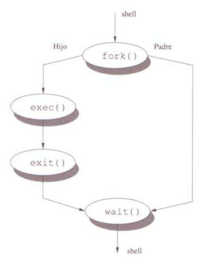

# Capítulo 3. PROCESOS
---

Un proceso es una abstracción que se utiliza en Linux para representar un programa que está en ejecución. Un programa es un conjunto de instrucciones y datos que se encuentran almacenados en un archivo ordinario. Cuando un programa es leído del disco (o de cualquier otro tipo de dispositivo de almacenamiento secundario) por el sistema operativo y cargado en memoria para ejecutarse, se convierte en un proceso. A través de esta abstracción se puede controlar el uso de la memoria, el tiempo que se utiliza el procesador, y los recursos de entrada y salida I/O.

El sistema operativo UNIX es un sistema multiprogramado, es decir, puede ejecutar múltiples programas simultáneamente. En un sistema UNIX típico suele haber en todo momento unas cuantas decenas, centenares o incluso miles de procesos existentes.

Esa cantidad puede parecer excesiva, pero conviene recordar que la ejecución de un proceso pasa por ráfagas alternativas de uso de CPU y de uso de dispositivos de E/S o de espera a que se produzcan determinados eventos. Mientras un proceso está a la espera de que finalice una operación de E/S o a que se produzca un cierto evento, la CPU se puede aprovechar para ejecutar algún otro proceso. En especial, los procesos interactivos (es decir, aquellos que están asociados a un terminal y avanzan a medida que el usuario pulsa teclas o botones del ratón) suelen pasar mucho tiempo inactivos esperando a que el usuario inicia alguna acción, con lo que tener gran cantidad de procesos interactivos supone en general escasa carga de CPU.

Los procesos existentes en un sistema UNIX se pueden dividir, grosso modo, en tres categorías:

 * **procesos de usuario**: Son todos aquellos que están ejecutando alguna aplicación de algún usuario particular, bien sea interactiva o no interactiva.

 * **demonios**: Son aquellos procesos que ofrecen servicios a los usuarios del sistema o a otros procesos y que generalmente se inician durante el arranque del sistema operativo. Los demonios nunca son procesos interactivos.

 * **procesos del núcleo**: Son los procesos que se ejecutan en el contexto del núcleo y dan servicios de bajo nivel, como paginación para la memoria virtual, o certos servicios básicos que requieren altas prestaciones, como un servidor de NFS.

Un proceso interesante es *init*, cuyo PID siempre es 1, que se encarga de inicializar el sistema.

Todo proceso tiene una serie de atributos que lo definen. Entre ellos se pueden destacar:

 * **PID** *(Process IDentifier)*: es un número único que identifica al proceso y que es asignado por el sistema operativo al crearlo. Es imprescindible conocerlo para hacer cualquier operación con un proceso.

 * **PPID** *(Parent PID)^*: es el PID del proceso que ha creado este proceso. Si el proceso padre muere, el PPID de sus hijos pasa a ser 1, con lo que el demonio *init* hereda los procesos huerfanos.

 * **PGID** *(Process Group IDentifier)*: en UNIX, los procesos se pueden organizar en grupos, lo cual permite manejarlos conjuntamente. Por tanto, cada proceso pertenece a un grupo de procesos, que se indica por medio de este identificador. Los hijos de un proceso heredan el PGID del padre al ser creados, aunque posteriormente lo pueden cambiar para dar origen a nuevos grupos de procesos.

 * **Credenciales (RUID, EUID, RGID, EGID)**: son el UID real y efectivo y la lista de grupos reales y efectivos a los que pertenece este proceso. El sistema operativo utiliza estos atributos, particularmente EUID y EGID, para comprobar si el proceso puede acceder a los recursos (ficheros, semáforos, otros proceso, etc.) o no.

 * **Prioridad**: la prioridad de un proceso en UNIX es un valor que crece y decrece dinámicamente en función de una serie de fórmulas matemáticas que tienen en cuenta la carga del sistema, el uso reciente de CPU del proceso y otros factores.

 Uno de esos factores es el llamado valor **nice**, que no es más que un parámetro que interviene en dicha fórmula. El valor *nice* de un proceso se hereda del proceso que lo ha creado aunque posteriormente puede variar durante su ejecución. Su rango oscila entre -20 y +20 o entre 0 y +39, según la variante del sistema UNIX. Dado que en UNIX un valor de prioridad numéricamente más bajo indica una mayor prioridad, un valor de *nice* más bajo hará que la prioridad del proceso sea mayor de lo habitual, mientras que un valor de *nice* más alto hará que el proceso sea menos prioritario. No obstante, debe recordarse que el sistema UNIX promociona poco a poco a los procesos que están en espera de obtener el procesador, por lo que, por muy alto que sea el valor de *nice*, cualquier proceso siempre acaba obteniendo de vez en cuando la CPU.

 Los usuarios normales únicamente pueden subir el valor de *nice*, mientras que el superusuario puede asignar cualquier valor de *nice* que desee.

 * **Terminal**: los procesos interactivos siempre están asociados a un terminal o pseudoterminal, que es el dispositivo por el cual realizan su entrada y salida estándar (salvo que éstas se hayan redirigido a un fichero).

 * **Estado**: indica si el proceso está en ejecución, bloqueado, expulsado a disco, etc. Los principales estados de un proceso son:

    - **R** *(runnable)*: indica que el proceso está en ejecución o preparado para ejecutarse.

    - **S** *(sleeping)*: el proceso está bloqueado, pero lleva menos de 20 segundos de espera. Posiblemente esté activo, aunque en estos precisos momentos está esperando por algún motivo.

    - **I** *(idle)*: el proceso está bloqueado y lleva más de 20 segundos detenido. En la práctica esto equivale a decir que el proceso está inactivo.

    - **D** *(disk wait)*: el proceso está bloqueado, a la espera de que finalice una operación de disco o similar.

    - **T** *(stopped)*: el proceso está suspendido temporalmente (a causa de una señal TSTP o STOP). Hasta que no reciba la señal CONT, está completamente inactivo.

    - **Z** *(zombie)*: el proceso ha finalizado y sólo falta que el sistema libere sus recursos y el padre recoja su código de salida.

 * **Nombre y argumentos**: en cualquier momento se puede averiguar el nombre del programa que un proceso está ejecutando y los argumentoscon que fue invocado.


Para visualizar los procesos existentes en el sistema, se utiliza el comando [**ps**](03.2.1.md).

### CICLO DE VIDA DE UN PROCESO

Para crear un nuevo proceso se utiliza la llamada del sistema *fork*. Crea una copia de un proceso existente. El nuevo clon del proceso será idéntico al original (proceso padre). Este nuevo proceso tiene un PID distinto y su propia información sobre su configuración.

Después de usar *fork*, el proceso hijo (la copia del proceso original) utilizará *exec* (una de las llamadas del sistema) para abrir un nuevo programa.

*init* también juega un papel muy importante en la gestión de procesos. Cuando se completa un proceso, llama a la rutina *exit* para comunicarle al kernel que está listo para cerrarse. Proporciona un código de salida (un número entero) que explica por qué va a cerrarse. Por convenio, el 0 se utiliza para indicar que el proceso se ha completado con normalidad.

Antes de permitir que un proceso se cierre, Linux exigirá que el proceso padre "sepa" que se va a cerrar su proceso hijo. Recibirá una llamada de espera. El proceso padre recibe una copia del código de salida del proceso hijo y, si lo desea, puede hacerse con un resumen de la finalidad del proceso hijo.

Si el proceso padre termina antes que el hijo, el kernel se dará cuenta de que no habrá nadie para atender la llamada de espera, por lo que modificará el proceso para convertirlo en un hijo de *init*. *init* aceptará a estos procesos y se encargará de atender las llamadas de espera necesarias para finalizarlos.



### PRIORIDAD DE UN PROCESO

La prioridad de los procesos se puede alterar por medio de los programas **nice** y **renice**. El primero se utiliza al crear el proceso y el segundo se usa para cambiar la prioridad de procesos ya creados. Los usuarios normales sólo pueden bajar la prioridad de sus propios procesos (dar valores de *nice* más altos), mientras que el superusuario puede establecer cualquier valor de *nice* que desee para cualquier proceso del sistema.

Cuando se crea un proceso, su valor de *nice* inicial es idéntico al del proceso que lo ha creado. Si, por ejemplo, un intérprete de mandatos tiene un valor de *nice* de +10, entonces todos los mandatos que ejecute el usuario en cuestión desde ese intérprete de mandatos comenzarán con un valor de *nice* de +10.

En condiciones normales, el valor de nice de los procesos de los usuarios es cero (es decir, prioridad media).

Ejemplos:

Si se ejecuta un programa anteponiendo la palabra *nice* en la línea de mandatos, dicho programa se ejecuta con una prioridad diferente. Por ejemplo, la orden *nice +10 make todo* ejecutaría la orden *make todo* con un valor de *nice* de +10.

Si en un sistema se ejecuta el siguiente proceso:

```bash
F   UID   PID  PPID PRI  NI    VSZ   RSS WCHAN  STAT TTY        TIME COMMAND
0  5000 18120 17999  20   0 106112  1304 wait   S    pts/0      0:00 /bin/bash ./prueba.sh
```

Y se ejecuta la orden *renice +5 -p 18120*, el proceso pasará a tener un valor de *nice* de +5:

```bash
F   UID   PID  PPID PRI  NI    VSZ   RSS WCHAN  STAT TTY        TIME COMMAND
0  5000 18120 17999  25   5 106112  1304 wait   SN   pts/0      0:00 /bin/bash ./prueba.sh
```

Obsérvese que el programa **ps** añade una N al estado de los procesos con valores de *nice* positivos. Para los procesos con valores de nice negativos añade un carácter <.

Si se ejecuta **renice** con un valor de *nice* inferior al que actualmente tiene el proceso y el usuario que lo ejecuta no es el superusuario, el sistema devuelve un error de operación no permitida. Obsérvese que esto significa que si un usuario normal reduce la prioridad de un proceso, ya no puede volver a subírsela, ni siquiera a valores que tenía antes. En el caso del ejemplo anterior, una vez cambiado el valor de *nice* a +5, el dueño del proceso ya no podrá volver al valor de *nice* de 0 que tenía originalmente. Sólo podrá seguir bajándola hasta +20, en todo caso. En cambio, el superusuario sí puede volver a valores de *nice* más prioritarios en cualquier momento.

### SEÑALES

Los procesos pueden recibir indicaciones de que se han producido determinados sucesos. Estas indicaciones se denominan señales. Las señales se originan, o bien porque otro proceso envía la señal al proceso en cuestión, o bien porque el núcleo del sistema operativo la genera automáticamente por algún motivo.

Un proceso sólo puede enviar señales a otros procesos del mismo usuario o a sí mismo. De esta limitación quedan excluidos los procesos del superusuario, que pueden enviar señales a cualquier proceso del sistema.

Como ejemplo de señales que genera automáticamente el núcleo, cuando un proceso efectúa una referencia a memoria virtual incorrecta o fuera de límites, el procesador genera una excepción, que hace que se ejecute una rutina del núcleo que genera una señal para el proceso que ha efectuado dicha referencia. También cuando la persona que está ejecutando un programa interactivo pulsa determinadas combinaciones de teclas, como *Control-C* o *Control-Z*, el manejador de terminal del núcleo genera señales para el proceso.

Cada señal tiene definida una acción por defecto que en muchos casos no es más que terminar de inmediato la ejecución del proceso. Algunas de ellas además provocan que se genere un fichero con un volcado de memoria del proceso con el objetivo de que se pueda depurar a posteriori (un "core dump"). Pero por otro lado, un proceso puede capturar las señales, haciendo que para cada una se ejecute una rutina propia al recibirla, y también puede ignorar las señales que desee, salvo un par de excepciones que se verán seguidamente.

El sistema UNIX define varias decenas de señales diferentes, pero algunas de las más interesantes son:

 * **TERM**: indica al proceso que debe terminar su ejecución. No obstante, el proceso la puede ignorar y seguir ejecutándose. También puede capturarla para que cuando se reciba se ejecute alguna rutina que termine la ejecución de manera ordenada.

 * **KILL**: fuerza la terminación inmediata del proceso. No es posible ignorarla ni capturarla.

 * **INT** y **TSTP**: indican que el usuario ha pulsado las teclas *Control-C* o *Control-Z*, respectivamente, durante la ejecución de un programa interactivo. Su acción por defecto es terminar el proceso o suspenderlo, respectivamente, aunque se pueden ignorar o capturar.

 * **STOP**: fuerza la suspensión temporal de la ejecución de un proceso. No se puede ignorar ni capturar.

 * **CONT**: reanuda la ejecución de un proceso suspendido temporalmente (bien sea mediante TSTP o mediante STOP).

 * **HUP**: en los procesos interactivos, indica pérdida de portadora en su terminal asociado (en otras palabras, que la sesión interactiva ha terminado súbitamente). Su acción por defecto es terminar el proceso, aunque se puede ignorar o capturar. Muchos demonios la utilizan para releer su configuración.

 * **USR1** y **USR2**: no tienen ningún significado estándar, sino que cada proceso puede capturarlas para darles el que desee. Su acción por defecto es terminar el proceso.

Obsérvese que, salvo las señales KILL y STOP, todas las demás se pueden capturar para ejecutar una rutina arbitraria o incluso ignorarlas sin más. Por tanto, se puede redefinir su significado y efecto a voluntad. De hecho, en el caso de los demonios es muy común capturar las señales que sólo tienen sentido para procesos interactivos, como HUP o INT, de forma que se puedan utilizar para otros fines. Por ejemplo, muchos demonios releen sus ficheros de configuración al recibir la señal HUP. Esto permite efectuar cambios en la configuración de un demonio y hacer que entren en efecto sin tener que matar y reiniciar el demonio en cuestión o reiniciar todo el sistema operativo. En otras ocasiones, la señal INT se utiliza para que el demonio vuelque en un cierto fichero información sobre su estado interno.

Ejemplos:

Las señales se envían por medio del programa **kill** (o, en ciertos casos, pulsando determinadas combinaciones de teclas, tal como se ha indicado antes). La sintáxis de uso de la orden **kill** es:

    **kill** *-señal lista_PID*

Por ejemplo, *kill -TERM 14 19 198* envía la señal *TERM* a los procesos con PID *14*, *19* y *198*.

La lista completa de señales se puede obtener ejecutando *kill -l* o bien consultando la página de manual signal(3).

Algunas personas tienen la costumbre de usar siempre la señal KILL para terminar procesos. Ahora bien, no es recomendable matar procesos enviándoles a la primera la señal KILL. Es mejor enviar primero la señal TERM, por si el proceso la captura para terminar su ejecución de forma ordenada (borrando ficheros temporales, desbloqueando recursos, etc.). Sólo si se observa que el proceso no muere con TERM pasados unos segundos, entonces se puede recurrir a enviar la señal KILL.

Por otra parte, bajo determinadas circunstancia una señal puede no ser eficaz al instante. Esto sucede cuando el proceso que la recibe está detenido dentro del núcleo en alguna espera no interrumpible y también cuando se trata de un proceso zombi.

### CONTROL DE TRABAJOS

El control de trabajos es una característica proporcionada por la mayoría de los intérpretes de mandatos que permite a los usuarios el control simultáneo de múltiples procesos, que van a ser denominados *jobs*.

Cuando se inicia un programa, éste normalmente toma el control de la terminal impidiendo realizar cualquier otra tarea, es decir, el proceso se ejecuta en primer plano (*foreground*). Existen ciertos programas que tardan mucho tiempo en ejecutarse y, sin embargo, no son interactivas; como por ejemplo la compilación de un programa. En estos casos, UNIX proporciona la posibilidad de ejecutar comandos en segundo plano (*background*). Al ejecutar un proceso en segundo plano, la shell devuelve el *prompt* inmediatamente y se puede seguir trabajando en la terminal aún cuando el proceso en *background* siga ejecutándose. Para poner un proceso trabajando en *batch*, la línea del mandato debe acabar con un símbolo de *ampersand* (*&*). El *ampersand* dice a la shell que ejecute la orden, pero que no se quede esperando al proceso hijo.

Ejemplos:

```bash
$ yes
y
y
y
y
Ctrl-C
```

Con *Ctrl-C* le envío la señal INT al proceso para que termine su ejecución.

```bash
$ yes > /dev/null &
[1] 23481
$
```

En este caso, se ejecuta el mandato en segundo plano, por lo que la shell devuelve el *prompt*, indicándonos que está esperando nuevas órdenes. El [1] representa el número de trabajo (*job number*) para el proceso *yes* y el 23481 es el identificador de proceso. Podemos comprobar el estado del proceso utilizando la orden interna del shell **jobs**.

```bash
$ jobs
[1]+  Running                 yes > /dev/null &
```

El proceso puede ser eliminado con el programa **kill** especificando su identificador. Existe, además, otra forma de identificar al trabajo que consisten en el empleo del número de trabajo (*job number*) precedido del carácter %. Otra forma de matar el proceso sería:

```bash
$ kill -TERM %1
```

Para comprobar que el proceso está muerto, se puede utilizar nuevamente el comando **jobs**:

```bash
$ jobs
[1]+  Terminated              yes > /dev/null
```

Si el trabajo está suspendido significa que el sistema operativo no le va a asignar tiempo de procesador. Sin embargo, el trabajo puede reiniciarse en el punto en que fue suspendido. Para reiniciar el trabajo se utiliza el comando **fg** (*foreground*).

```bash
$ yes > /dev/null &
[1] 24514
$ ps up 24514
USER       PID %CPU %MEM    VSZ   RSS TTY      STAT START   TIME COMMAND
sistemas 24514 95.7  0.0 100956   576 pts/0    R    16:05   0:36 yes
$ jobs
[1]+  Running                 yes > /dev/null &
$ fg
yes > /dev/null
^Z
[1]+  Stopped                 yes > /dev/null
$ jobs
[1]+  Stopped                 yes > /dev/null
$ !ps
ps up 24514
USER       PID %CPU %MEM    VSZ   RSS TTY      STAT START   TIME COMMAND
sistemas 24514 84.6  0.0 100956   576 pts/0    T    16:05   1:15 yes
$ bg
[1]+ yes > /dev/null &
$ jobs
[1]+  Running                 yes > /dev/null &
$
```
