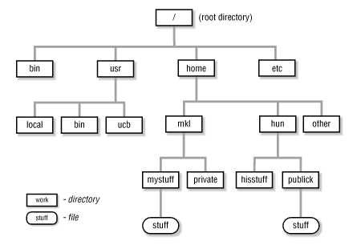
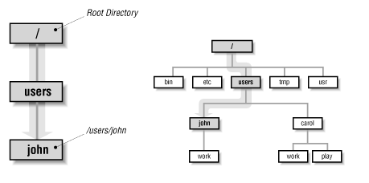
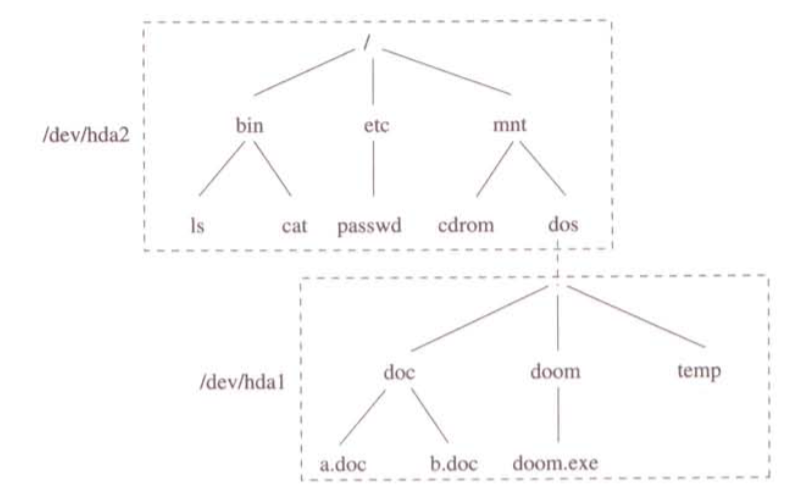

# 4.- SISTEMA DE FICHEROS

Una de las principales funciones de los sistemas operativos es ocultar los detalles acerca de cómo y dónde se almacena la información y cómo funcionan los discos y demás dispositivos de E/S. Para ello, se presenta al usuario un modelo abstracto basado en unidades de almacenamiento lógico, denominadas *archivos*, éstas actúan como un mecanismo de abstracción, proporcionando una manera de almacenar información en el disco, para su posterior lectura. La visión que los usuarios tienen del sistema de ficheros es muy distinta de la que tiene el sistema operativo en el ámbito interno. Los usuarios ven los archivos como un conjunto de información estructurada según sus necesidades o las de sus aplicaciones, mientras que el sistema operativo los contempla como conjuntos de datos estructurados según sus necesidades de almacenamiento y representación.

Cada fichero viene descrito por una estructura de datos llamada **inodo**, que contiene sus atributos (tipo, dueño, grupo, permisos, tamaño, fechas de creación y último acceso...) y que también apunta a los bloques de datos del fichero. Físicamente, un archivo es una secuencia de bytes: el sistema operativo no sabe, ni le importa, qué hay en el archivo. Todo lo que ve son bytes. Cualquier significado debe ser impuesto por los programas a nivel de usuario.

Los procesos pueden leer los archivos existentes y crear otros si es necesario. La información que se almacena en los archivos es persistente, es decir, no se ve afectada por la creación y terminación de los procesos. Un archivo debe desaparecer sólo cuando su propietario lo elimine de manera explícita. Cuando un proceso crea un archivo le proporciona un nombre. Cuando el proceso termina, el archivo continúa existiendo y puede ser utilizado por otros procesos mediante su nombre. Desde el punto de vista del usuario, el archivo es la única forma de gestionar el almacenamiento secundario.

Para poder acceder a los archivos con facilidad, Linux utiliza una estructura de directorios jerárquica en forma de árbol, conocida generalmente como sistema de ficheros. El sistema de ficheros es una forma de base de datos; éste proporciona una estructura que permite transformar un simple dispositivo de bloques en una jerarquía sofisticada de archivos y subdirectorios que los usuarios puedan entender. El directorio base o padre del árbol se denomina directorio raíz y se representa con una barra invertida (**/**). Un sistema Linux, no hace distinción entre un archivo y un directorio, ya que los directorios se implementan como archivos que contiene nombres de otros archivos.

En GNU/Linux, se utiliza la *Filesystem Hierarchy Standard (FHS)*, la jerarquía estándar de sistemas de ficheros, que especifica cómo se han de organizar. El sistema de archivos se estructura, como ya hemos dicho, de forma jerárquica, partiendo de su raíz (*/*). De la raíz, y siguiendo la FHS, lo habitual es encontrarnos con los siguientes directorios:

 * **/bin**: en este directorio se almacenan los comandos básicos para todos los usuarios del sistema operativo.

 * **/boot**: en este directorio se almacenan los archivos estáticos necesarios para el arranque del sistema, incluido lo necesario para que el cargador de arranque funcione correctamente.

 * **/dev**: en este directorio se almacenan los ficheros que representan a los dispositivos del sistema.

 * **/etc**: en esta ubicación se suelen almacenar los ficheros de configuración del sistema y de las aplicaciones que se hallan instaladas en el mismo. En muchas distribuciones también se almacenan aquí los *scripts* de arranque del propio sistema operativo.

 * **/home**: colgando de este directorio se guardan los directorios personales (directorio *home*) de los usuarios.

 * **/lib**: aquí se disponen las librerías que el núcleo del sistema y los módulos del mismo necesitan para funcionar.

 * **/mnt**: en este directorio se solían montar los dispositivos, aunque en la actualidad muchas distribuciones se decantan por usar un directorio */media* para ello.

 * **/proc**: este es un directorio que podríamos llamar falso, ya que no existe como tal en el disco duro. En él se almacena el estado del kernel, en lo que a variables y procesos se refiere.

 * **/root**: es un directorio *home* especial, ya que es el del usuario *root*.

 * **/sbin**: en este directorio se guardan los comandos de administración especiales para el usuario *root*.

 * **/tmp**: es el directorio en el que se guardan los archivos temporales. Según la distribución, éstos se borran al arrancar el sistema o cada cierto período de tiempo.

 * **/usr**: es una segunda estructura jerárquica, utilizada para almacenar todo el software de usuario instalado en el sistema.

 * **/var**: es un directorio en el que su contenido, al menos en teoría, debería ser muy cambiante, ya que contiene, entre otros, los subdirectorios de logs, los de las colas de impresión, y los de las carpetas de correo electrónico de los usuarios. Sin embargo, y por poner un ejemplo de aplicación que no responde exactamente a esta definición, en */var/www* se suelen almacenar los ficheros HTML de los servidores web.



De manera general, se podría afirmar la siguiente declaración:

`"En un sistema Linux, todo es un archivo; si algo no es un archivo, es un proceso"`

### DIRECTORIO HOME

Cuando un usuario se registra en un sistema Linux, el directorio sobre el que se sitúa se denomina *directorio home* de dicho usuario. Este directorio, único en el sistema de ficheros Linux, sólo puede ser accedido por el administrador del sistema y por el propio usuario, por lo que es el lugar idóneo para almacenar y organizar los archivos de usuario.

### DIRECTORIO DE TRABAJO

El *directorio de trabajo* (también llamado *directorio actual*) es el directorio sobre el que se está trabajando. Cada vez que un usuario se registra en un sistema Linux, el *directorio home* coincide con el *directorio de trabajo*. Se puede cambiar a otro directorio, en cuyo caso el directorio al que se mueva, se convertirá en el *directorio de trabajo*.

A menos que se indique lo contrario, todos los comandos que se introduzcan se aplicarán a los archivos en el *directorio de trabajo*. De la misma manera, cuando se crean archivos, éstos son creados en el *directorio de trabajo* a menos que se especifique otro directorio.

Cada proceso tiene su propio directorio de trabajo, por lo que cuando éste cambia y después termina ningún otro proceso se ve afectado y no quedan rastros del cambio en el sistema de archivos. De esta forma, siempre es perfectamente seguro para un proceso cambiar su directorio de trabajo cada vez que sea conveniente.

### NOMBRES DE RUTAS

Para especificar cada archivo dentro de la jerarquía de directorio, se proporciona su nombre de ruta de la parte superior de la jerarquía de directorios, el directorio raíz. Dichos nombres de ruta absolutos consisten de la lista de directorios que deben recorrerse desde el directorio raíz para llegar al archivo, y se utilizan barras diagonales para separar los componentes.

Cuando el sistema de archivos está organizado como un árbol de directorios, se necesita cierta forma de especificar los nombres de los archivos. Por lo general se utilizan dos métodos distintos. En el primer método, cada archivo recibe un **nombre de ruta absoluto** que consiste de la lista de directorios que deben recorrerse desde el directorio raíz para llegar al archivo, y se utilizan barras diagonales para separar los componentes. Los nombres de ruta absolutos son únicos.



El otro tipo de nombre es el **nombre de ruta relativa**. Éste se utiliza en conjunto con el concepto del directorio de trabajo (también llamado directorio actual). Un usuario puede designar un directorio como el directorio de trabajo actual, en cuyo caso todos los nombres de las rutas que no empiecen en el directorio raíz se toman en forma relativa al directorio de trabajo.

Algunos programas necesitan acceder a un archivo específico sin importar cuál sea el directorio de trabajo. En ese caso, siempre deben utilizar nombres de rutas absolutas. El nombre de la ruta absoluta siempre funcionará, sin importar cuál sea el directorio de trabajo.

Linux, al igual que la mayoría de los sistemas operativos que proporcionan un sistema de directorios jerárquico, tiene dos entradas especiales en cada directorio: "**.**" y "**..**", que por lo general se pronuncian "punto" y "punto punto". "punto" se refiere al directorio actual; "punto punto" se refiere al directorio padre (excepto en el directorio raíz que se refiere a sí mismo).

### TIPOS DE SISTEMAS DE FICHEROS


### TIPOS DE FICHEROS

Los diversos tipos de ficheros: 

 * **Ficheros normales**: 

 * **Directorios**:

 * **Enlaces simbólicos**:

 * **Ficheros especiales de dispositivo**:

 * **Tuberías**:

 * **Sockets locales**:

De ellos, sólo los tres primeros tienen bloques de datos asociados y realmente se puede decir que estén relacionados con el sistemas de ficheros. Los *ficheros especiales de dispositivo*, *tuberías* y *sockets locales* no son más que un mecanismo de acceso a recursos de E/S y de comunicación entre procesos que utiliza la interfaz del sistema de ficheros en aras de la homogeneidad del sistema.

### ESTRUCTURA DE UN SISTEMA DE FICHEROS


### CREACIÓN DE UN SISTEMA DE FICHEROS 

Una vez que se ha finalizado el proceso de partición de un disco, ya se está listo para crear un sistema de ficheros. Al igual que con el proceso de partición, la creación del sistema de ficheros se va a realizar desde el espacio de usuario debido a que un proceso del espacio de usuario puede acceder directamente y manipular un dispositivo de bloque a través de un archivo especial de dispositivo. La utilidad [mkfs](04.5.1.md) nos permite crear varios tipos de sistemas de ficheros. Por ejemplo:

```bash
# mkfs -t ext4 /dev/sda
```

Cuando se crea un sistema de ficheros, **mkfs** imprime por pantalla un diagnóstico de como trabaja, incluyendo la salida perteneciente al superbloque. El superbloque es un componente clave en el nivel superior de la base de datos del sistema de ficheros, y es tan importante que **mkfs** crea una serie de copias de seguridad en caso de que el original se destruya.

En realidad, **mkfs** es sólo un frontend para una serie de programas de creación de sistemas de ficheros, **mkfs.fs**, donde **fs** es un tipo de sistema de ficheros. Así que cuando se ejecuta *mkfs -t ext4*, *mkfs* a su vez ejecuta *mkfs.ext4*.

### MONTAJE DE SISTEMAS DE FICHEROS 

Todo sistema UNIX tiene un sistema de ficheros que actúa como sistema de ficheros raíz. Este sistema de ficheros es montado automáticamente por el propio núcleo al arrancar el sistema. A partir de este momento se dispone de un directorio raíz / y de los subdirectorios y ficheros que el sistema de ficheros raíz contenga.

Una vez se dispone de un sistema de ficheros raíz, se puede montar sobre él cualquier otro sistema de ficheros a partir de alguno de sus subdirectorios. Y, generalizando, es posible montar un sistema de ficheros a partir de un directorio de cualquier sistema de ficheros previamente montado (aunque no sea el sistema de ficheros de raíz). Estos montajes ya no los realiza automáticamente el núcleo, sino que se hacen en base a órdenes y/o ficheros de configuración, por lo que el administrador es quien lo establece según su propio criterio.

El sistema operativo se encarga de que todos esos sistemas de ficheros separados aparenten ser uno solo de cara al usuario, haciendo transparente a usuarios y aplicaciones el paso de un sistema de ficheros a otro en el momento que se atraviesa el directorio en el cual está montado el segundo.

Como los montajes se hacen a nivel VFS, es posible integrar en ese único árbol global todo tipo de sistemas de ficheros, sean de UNIX o no, sean locales o remotos, estén almacenados en una partición de un disco físico o en múltiples particiones, sean verdaderos sistemas de ficheros u otros módulos con apariencia de sistema de ficheros.



Aunque cabe la posibilidad de tener un único sistema de ficheros en el que se almacene todo el software del sistema y todos los datos de los usuarios, suele ser recomendable usar sistemas de ficheros diferentes para cosas diferentes y luego montarlos todos ellos en un sólo árbol de sistemas de ficheros.

Para comprobar el estado actual de los sistemas de ficheros en nuestro sistema, se ejecuta el comando **mount**. La salida debería tener este aspecto:

```bash
$ mount
/dev/sda1 on / type ext4 (rw,errors=remount-ro)
proc on /proc type proc (rw,noexec,nosuid,nodev)
sysfs on /sys type sysfs (rw,noexec,nosuid,nodev)
none on /sys/fs/fuse/connections type fusectl (rw)
none on /sys/kernel/debug type debugfs (rw)
none on /sys/kernel/security type securityfs (rw)
udev on /dev type devtmpfs (rw,mode=0755)
devpts on /dev/pts type devpts (rw,noexec,nosuid,gid=5,mode=0620)
tmpfs on /run type tmpfs (rw,noexec,nosuid,size=10%,mode=0755)
--snip--
```

Cada línea corresponde a un sistema de ficheros montado en la actualidad, y su formato indica:

*dispositivo on punto_montaje type tipo_sist-ficheros opciones*

donde:

 * *dispositivo*: El dispositivo, tal como */dev/sda3*. Nótese que algunos no son dispositivos reales (**proc**, por ejemplo) pero son sustitutos para nombres de dispositivo reales porque estos sistemas de ficheros de propósito especial no necesitan dispositivos.

 * *punto_montaje*: directorio sobre el que se desea montar este sistema de ficheros.

 * *tipo_sist-ficheros*: tipo de sistema de ficheros a utilizar.

 * *opciones*: opciones de montaje. 

Para montar un sistema de ficheros, se utiliza el comando [**mount**](04.5.2.md): 

```bash
# mount -t type device mountpoint
```

Normalmente, no es necesario especificar la opción *-t type* debido a que el comando **mount** puede averiguarlo por nosotros. Después de dar la orden anterior, cualquier acceso al directorio especificado en el punto de montaje es transparente para el usuario.

Cuando montamos un sistema de ficheros, el núcleo actualiza una tabla interna conocida como tabla de montajes (mount table), añadiéndole una nueva entrada con objeto de mantener en todo momento el estado del sistema de ficheros completo. Cada entrada en la tabla de montajes contiene lo siguiente:

 * El número de dispositivo que identifica al sistema de archivos montado.

 * Un puntero al *buffer* donde se almacena el superbloque del sistema de ficheros.

 * Un puntero al *inodo* raíz del sistema de ficheros montado.

 * Un puntero al *inodo* del directorio que actúa como punto de montaje.

La asociación del *inodo* del punto de montaje y del *inodo* del sistema de ficheros montado, realizada por la llamada **mount**, permite al núcleo (llamada **chdir**) atravesar este puente sin ningún tipo de problema.

Para desmontar un sistema de ficheros, se utiliza el comando [**unmount**](04.5.3.md):

```bash
# unmount mountpoint|device
```

El método de montaje de sistemas de ficheros utilizado hasta ahora depende de los nombres de dispositivos. Sin embargo, los dispositivos mostrados pueden cambiar, ya que dependen del orden en el que el núcleo encuentra los dispositivos. Para resolver este problema, se puede identificar y montar sistemas de ficheros por su identificador único universal (UUID), un estándar de software. El UUID es un tipo de número de serie, y cada uno debe ser diferente. Los programas de creación de sistemas de archivos como **mke2fs** generan un identificador UUID cuando se inicializa la estructura de datos del sistema de ficheros.

Para ver una lista de los dispositivos y los correspondientes sistemas de ficheros y UUIDs en el sistema, se utiliza el programa **blkid** (block ID):

```bash
# blkid
/dev/sdf2: UUID="a9011c2b-1c03-4288-b3fe-8ba961ab0898" TYPE="ext4"
/dev/sda1: UUID="70ccd6e7-6ae6-44f6-812c-51aab8036d29" TYPE="ext4"
/dev/sda5: UUID="592dcfd1-58da-4769-9ea8-5f412a896980" TYPE="swap"
/dev/sde1: SEC_TYPE="msdos" UUID="3762-6138" TYPE="vfat"
```

En este ejemplo, **blkid** encuentra cuatro particiones con datos: dos con sistema de ficheros *ext4*, uno con una firma espacio de intercambio, y uno con un sistema de ficheros basado en FAT. Las particiones nativas de Linux tienen *UUIDs* estándar, pero la partición FAT no. Se puede referenciar a la partición FAT con su número de serie (en este caso, 3762-6138).

Para montar un sistema de ficheros por su UUID, es necesario utilizar la sintaxis *UUID=*. Por ejemplo, para montar el primer sistema de ficheros de la lista anterior en */home/extra*, se escribe:

```bash
# mount UUID=a9011c2b-1c03-4288-b3fe-8ba961ab0898 /home/extra
```

Por norma general, para realizar montajes manuales, se suele utilizar el nombre de dispositivo en lugar del identificador UUID ya que es más fácil de recordar. Sin embargo, si se quiere hacer un montaje de manera automática en tiempo de arranque a través de la tabla de sistemas de ficheros */etc/fstab*, es más conveniente utilizar el UUID.

Es posible cambiar el UUID de un sistema de ficheros ext2/ext3/ext4 a través del programa **tune2fs** (por ejemplo, si se ha copiado un sistema de ficheros completo de otro lugar y ahora se necesita distinguir del original).

### DISK BUFFERING, CACHING AND FILESYSTEMS

Linux, como otras versiones de Unix, cachea las escrituras a disco. Esto significa que el kernel no suele escribir de inmediato los cambios al sistema de ficheros cuando los procesos solicitan algún cambio. En su lugar, almacena los cambios en memoria RAM hasta que el kernel convenientemente puede hacer los cambios en disco. Este sistema de *buffering* es transparente al usuario y mejora el rendimiento.

Cuando se desmonta un sistema de ficheros con **unmount**, el núcleo automáticamente sincroniza con el disco. En cualquier otro momento, mediante la ejecución del comando **sync**, se puede forzar al núcleo a escribir los cambios almacenados en el buffer en disco. Si por alguna razón no se puede desmontar un sistema de ficheros antes de apagar el sistema, asegúrese de ejecutar el comando **sync** en primer lugar.

Además, el núcleo tiene una serie de mecanismos que utilizan la RAM automáticamente para cachear bloques leídos desde un disco. Por lo tanto, si uno o más procesos acceden repetidamente a un archivo, el núcleo no tiene que ir al disco una y otra vez, simplemente lee la caché, ahorrando tiempo y recursos.

### TABLA DE SISTEMAS DE FICHEROS /ETC/FSTAB

La configuración relativa a qué particiones tiene el sistema, y cómo se realizan los puntos de montaje en el proceso de arranque son establecidas por el administrador en la tabla de sistemas de ficheros, que se encuentra ubicada en el fichero */etc/fstab*.

A continuación se muestra un ejemplo típico de */etc/fstab*, y se explica brevemente su formato (para más información consúltese la página de manual de *fstab(5)*):

```bash
# Device                                    Mountpoint  FStype  Options                 Dump    Pass
#
proc                                        /proc       proc    nodev,noexec,nosuid     0       0
UUID=70ccd6e7-6ae6-44f6-812c-51aab8036d29   /           ext4    errors=remount-ro       0       1
UUID=592dcfd1-58da-4769-9ea8-5f412a896980   none        swap    sw                      0       0
/dev/sr0                                    /cdrom      iso9660 ro,user,nosuid,noauto   0       0
```

El formato de cada línea indica:

*fich_dispositivo   punto_montaje   tipo_sist-ficheros  opciones    cseg    pasada*

donde:

 * *fich_dispositivo*: corresponde al fichero de dispositivo o UUID de disco sobre el que se asienta el sistema de ficheros en cuestión.

 * *punto_montaje*: directorio sobre el que se desea montar este sistema de ficheros.

 * *tipo_sist-ficheros*: tipo de sistema de ficheros a utilizar. Existen varios tipos de sistema de ficheros posibles, cada uno de ellos con características diferentes.

 * *opciones*: opciones de montaje del sistema de ficheros. Las más habituales son:
    
    * *rw*: monta el sistema de ficheros en modo lectura/escritura.

    * *ro*: monta el sistema de ficheros en modo sólo lectura.

    * *defaults*: asigna las opciones de montaje predeterminadas que serán utilizadas para el sistema de archivos. Las opciones predeterminadas para *ext4* son: *rw*, *suid*, *dev*, *exec*, *auto*, *nouser*, *async*.

    * *dev*: permite interpretar dispositivos especiales en el sistema ficheros.

    * *nodev*: no permite interpretar dispositivos especiales en el sistema ficheros.

    * *exec*: permite la ejecución de binarios que se encuentren en el sistema de archivos.

    * *noexec*: no permite la ejecución de binarios que se encuentren en el sistema de archivos.

    * *suid*: permite las operaciones de los bits suid y sgid.

    * *nosuid*: bloquea el funcionamiento de los bits suid y sgid.

    * *errors*: establece el comportamiento del núcleo cuando el sistema tiene problemas para montar un sistema de ficheros. El valor por defecto *errors=continue*, indica al kernel que debe devolver un código de error y seguir su ejecución. Para que el núcleo trate de montar nuevamente el sistema de ficheros en modo sólo lectura, se usa *errors=remount-ro*. La opción *errors=panic* indica al kernel que detenga el sistema cuando haya un problema con el montaje.

    * *noauto*: el sistema de archivos no será montado automáticamente, solo cuando se le ordene manualmente.

    * *auto*: el sistema de archivos será montado automáticamente durante el arranque, o cuando la orden *mount -a* se invoque.

    * *user*: permite a cualquier usuario montar el sistema de archivos. Esta opción incluye *noexec*, *nosuid*, *nodev*, a menos que se indique lo contrario.

    * *nouser*: sólo permite al usuario *root* montar el sistema de ficheros.
    
    Para más información, consultar la página de manual *mount(8)*.

 * *cseg*: Información de copias de seguridad para usar por el comando **dump**. Un valor *0* indica que es un sistema de ficheros que no necesitará copia de seguridad. Un valor *1* indica que sí entra en las políticas de copias de seguridad. Se debería usar *0* en este campo.

 * *pasada*: indica el orden en el que, durante el proceso de arranque, los sistemas de ficheros son chequeados por las herramientas que verifican la integridad del sistema de ficheros (en este caso, *fsck*). Un valor *0* indica no hacer chequeo, un valor *1* indica en primer lugar, y un valor de *2* en segundo lugar. El sistema de ficheros raíz (el montado simbólicamente en */*) debe ser realizado siempre en primer lugar (un *1*, por tanto).

Los montajes especificados en este fichero se realizan siempre durante el proceso de arranque (salvo que la línea que especifica un sistema de ficheros contenga entre sus opciones el valor *noauto*, que indica que no lo haga automáticamente durante el proceso de arranque).

Si el sistema de ficheros aparece en el fichero */etc/fstab*, basta con especificar como parámetro sólo el punto de montaje, en cuyo caso el resto de los parámetros se obtendrán de dicho fichero. Por ejemplo, si se está usando el fichero */etc/fstab* anterior y se intenta montar un CD-ROM, simplemente sería necesario ejecutar *mount /cdrom*.

Se pueden montar todas las entradas que aparecen en */etc/fstab* de una vez (a excepción de las entradas que incluyan la opción *noauto*) con el siguiente comando:

```bash
# mount -a
```

También puede usarse el mandato **mount** para actualizar las opciones de montaje de un sistema de ficheros ya montado (por ejemplo, para pasar de sólo lectura a lectura y escritura), tal como se indica a continuación:

```bash
# mount -u [-o nuevas_opciones] punto_montaje
```

### CAPACIDAD DEL SISTEMA DE FICHEROS

Para ver el tamaño y la utilización de los sistemas de ficheros montados, se utiliza el comando. [**df**](04.5.4.md). 

```bash
$ df
Filesystem    1024-blocks    Used    Available  Capacity Mounted on
/dev/sda1         1011928    71400      889124      7%   /
/dev/sda3        17710044  9485296     7325108     56%   /usr
```

 * *Filesystem*: corresponde al fichero de dispositivo de disco sobre el que se asienta el sistema de ficheros en cuestión.

 * *1024-blocks*: la capacidad total del sistema de ficheros en bloques de 1024 bytes.

 * *Used*: el número de bloques utilizados.

 * *Available*: el número de bloques disponibles.

 * *Capacity*: el porcentaje de bloques en uso.

 * *Mounted on*: el punto de montaje.

El mandato *df* se usa principalmente para saber qué tamaño tienen los sistemas de ficheros y cuánto espacio les queda libre. Se puede añadir la opción *-i* para que también se visualice información sobre la cantidad de inodos existente y disponible. La opción *-h* imprime la información en un formato legible por humanos.

Como nota de interés cabe mencionar que si se observan las columnas de espacio de disco total, usado y disponible, se verá que la suma del espacio usado y el disponible no coincide con el espacio total, sino que este último es alrededor de un 5% superior. Esta característica permite que el sistema no falle inmediatamente tras quedarse sin espacio en disco. Si se agota el espacio disponible, el superusuario (pero no los usuarios normales) puede seguir escribiendo datos hasta agotar también ese 5%, en cuyo caso se observarán resultados curiosos al ejecutar *df*, como que el espacio disponible es negativo o que el porcentaje de utilización es superior al 100%. Evidentemente, en el uso normal del sistema, nunca debería llegarse a esos extremos.

If your disk fills up and you need to know where all of those space-hogging media files are, use the du command. With no arguments, du prints the disk usage of every directory in the directory hierarchy, starting at the current working directory. (That’s kind of a mouthful, so just run cd /; du to get the idea. Press CTRL-C when you get bored.) The du -s command turns on summary mode to print only the grand total. To evaluate a particular directory, change to that directory and run du -s *.*

Si el disco se llena, una manera de determinar que archivos o directorios están acaparando la mayor parte del espacio es utilizando el comando [**du**](04.5.5.md). Sin argumentos, **du** imprime el uso de disco de cada directorio en la jerarquía de directorios desde el *directorio de trabajo*. Ejemplo:

```bash
cd /; du
```

### CHEQUEO DEL SISTEMA DE FICHEROS

En el uso normal de los sistemas de ficheros de UNIX no debe producirse ningún error en la consistencia de la información almacenada en ellos, tanto datos como metadatos (información estructural del sistema de ficheros, como tablas de inodos y bloques de datos libres, estructura de directorios, punteros a bloques de datos, etc. Los datos son el contenido de los ficheros). Ahora bien, en situaciones excepcionales, como un apagón, un pánico del núcleo o un error de programación en el mismo, un fallo del hardware, una reinicialización súbita del sistema, y otros "desastres" similares, si puede dañarse la integridad o perderse algunos datos en aquellos sistemas de ficheros que se estuvieran modificando en el momento del desastre o en los instantes anteriores.

Por un lado, algunos datos o metadatos modificados en los segundos previos a la caída del sistema podrían hallarse aún en la caché de disco, la cual está ubicada en la memoria RAM del sistema y se habrán perdido completamente con la caída.

Por otro lado, diversas operaciones del sistema de ficheros conllevan varios pasos consecutivos de modificación del sistema de ficheros y quizá se hubieran realizado los primeros pasos, pero no los últimos. Por ejemplo, durante el borrado de un fichero quizá se hubiera marcado ya como libre el inodo que ocupaba, pero aún no se había llegado a liberar los bloques de datos que ocupaba ni a quitarlo del directorio en el que se encontraba.

Durante el proceso de arranque de un sistema UNIX siempre se comprueba de manera automática la integridad de los sistemas de ficheros antes de montarlos. En caso de que se detecte algún error fácil de eliminar, se corrige sin más, aunque esto puede conllevar la pérdida de algunos datos.

Esto se realiza mediante la herramienta **fsck**. Este programa también se puede ejecutar de forma manual para verificar puntualmente la integridad de algún sistema de ficheros y, en caso de que se detecten errores, corregirlos, o bien para comprobar algún aspecto concreto del mismo. Téngase en cuenta que **fsck** no puede recuperar los datos que estaban en la caché de disco en el momento de la caída, éstos se han perdido irremisiblemente. Por tanto, tras una caída súbita cabe la posibilidad de haber perdido información o que se hayan corrompido ficheros incluso aunque **fsck** no detecte ningún error o corrija automáticamente todos los que detecte.

Un formato de uso muy simplificado de esta herramienta se describe a continuación:

```bash
# fsck fich_dispositivo
```

donde *fich_dispositivo* ha de ser el fichero de dispositivo del sistema de ficheros que se desea chequear. La herramienta comprueba la integridad del sistema de ficheros y, si encuentra algún error, propone una forma de corregirlo y pide confirmación al usuario. También se puede añadir la opción *-y*, en cuyo caso el programa *fsck* no pide confirmación, sino que directamente realiza cualquier posible corrección que considere oportuna. Finalmente, si se añade la opción *-p* el programa chequea todos los sistemas de ficheros definidos en */etc/fstab* que tengan un valor distinto de cero en la correspondiente columna.

### SWAP

En UNIX, una o varias particiones pueden ser utilizadas como espacio dedicado a soportar los mecanismos de memoria virtual (*swapping*) presentes en el sistema. También es posible utilizar ficheros, aunque es menos eficiente.

En términos generales se recomienda reservar para el área de intercambio una cantidad de disco equivalente a entre 2 y 4 veces el tamaño de la memoria RAM disponible. Por otra parte, si se dispone de varios discos, se recomienda repartir el área de intercambio en trozos más o menos iguales entre todos ellos.

Las particiones del área de intercambio se especifican junto con los sistemas de ficheros en el fichero */etc/fstab*, aunque en este caso los valores de las columnas son fijos: el tipo de "sistema de ficheros" es *swap*, el punto de montaje es *none*, las opciones son *sw* y las columnas de copia de seguridad y chequeo son ambas *0*.

A continuación se muestra una entrada típica correspondiente a partición destinada a *swapping* tal y como puede aparecer en un fichero */etc/fstab*.

```bash
# Device    Mountpoint  FStype  Options     Dump    Pass
#
...
/dev/sdb    none        swap    sw          0       0
...
```

Aunque lo normal es poner estas particiones en el fichero */etc/fstab* durante la configuración inicial del sistema y no volver a ocuparse de ellas, cabe la posibilidad de añadir o quitar particiones de *swapping* manualmente. Para ello se utilizan los mandatos **swapon** y **swapoff**, respectivamente. Su utilización es muy sencilla:

```bash
# swapon fich_dispositivo
# swapoff fich_dispositivo
```

Para visualizar información sobre la cantidad y estado de los espacios de disco dedicados para swap en el sistema, se utiliza la orden:

```bash
# swapinfo
```
