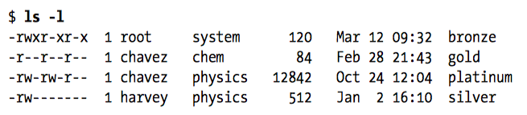
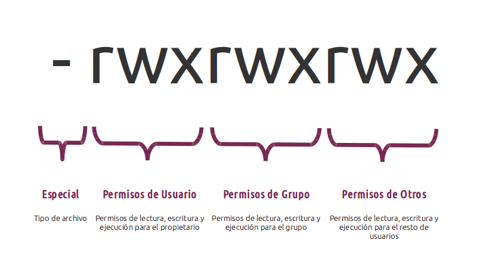
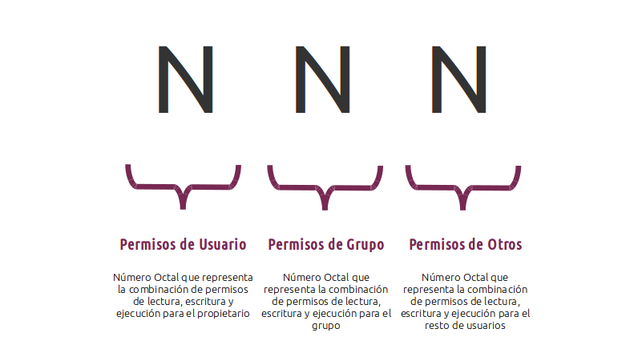
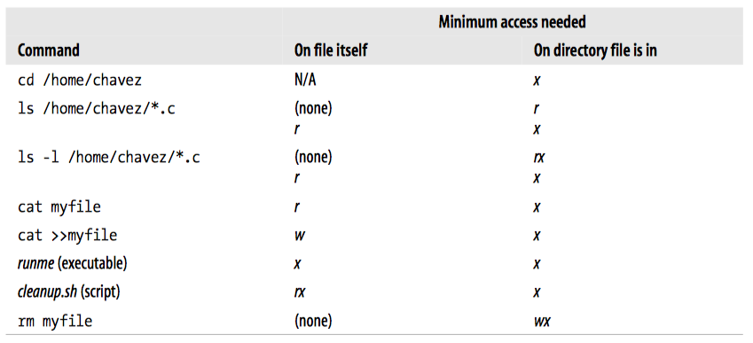

# 4.4.- PERMISOS

El sistema Linux proporciona la posibilidad de proteger la información. Para ello, asocia a cada archivo una serie de derechos de acceso (*propiedad* y *protección*). En función de éstos, se determina qué es lo que cada usuario puede hacer con el archivo.

### PROPIEDAD DEL ARCHIVO

En Unix todos los archivos pertenecen obligatoriamente a un usuario y a un grupo de usuarios. Cuando un usuario crea un nuevo archivo, el propietario del archivo será el usuario que lo ha creado y el grupo del archivo será el grupo principal de dicho usuario.

Ejemplo, si un usuario llamado 'dppascual' cuyo grupo principal es el grupo 'profesores' crea un nuevo archivo, el propietario del archivo será 'dppascual' y el grupo propietario del archivo será 'profesores', o lo que es lo mismo, el archivo pertenecerá al usuario dppascual y al grupo profesores.

Para mostrar el usuario y grupo de usuarios al que pertenece un archivo, se utiliza el comando [**ls**](04.5.9.md) añadiendo la opción **l** (formato largo):



Para poder cambiar el usuario y grupo de usuarios propietarios de un fichero, se utilizan los comandos [**chown**](04.5.6.md) y [**chgrp**](04.5.7.md).

### PROTECCIÓN DEL ARCHIVO

En el modelo tradicional de UNIX y Linux, cada archivo tiene asignado un grupo de 9 bits para sus permisos. Determinan qué se puede hacer con un archivo y quién puede desarrollar estas operaciones. Junto con otros tres bits que afectan a la operatividad de los programas ejecutables, estos bits constituyen lo que se conoce como el "modo" del archivo.

Los doce bits se guardan junto con otros cuatro, que hacen referencia al tipo de archivo. Los cuatro bits correspondientes al tipo de archivo se configuran durante su creación y no se podrán cambiar. Los únicos que podrán cambiar los doce bits correspondientes al modo del archivo serán su propietario y el superusuario. Para ello, se utilizará el comando [**chmod**](04.5.8.md).

Este conjunto de nueve bits se dividen en tres grupos de permisos que definen los derechos de acceso para el propietario, para el grupo de propietarios y para el resto de usuarios. Cada uno de estos grupos tiene 3 bits: uno para lectura, otro para escritura y otro para ejecución.



El primer bit indica el tipo de archivo. Generalmente pueden darse los siguientes casos:

```
-  |  Se trata de un archivo regular
d  |  Se trata de un directorio
l  |  Se trata de un enlace simbólico
b  |  Se trata de un archivo especial de bloques
c  |  Se trata de un archivo especial de caracteres
p  |  Se trata de una tubería
s  |  Se trata de un socket
```

El resto de los 9 bits que vienen a continuación representan los permisos del usuario propietario del archivo o directorio, los permisos del grupo de propietarios, y los permisos del resto de usuarios:

```
r  |  Se dan permisos de lectura
w  |  Se dan permisos de escritura
x  |  Se dan permisos de ejecución
-  |  No se da el permiso de lectura, escritura o ejecución
```

Conviene hablar de los permisos de los archivos como números octales (de base 8) porque cada uno de sus dígitos representa tres bits y cada grupo de permisos contiene 3 bits. Se sustituye cada grupo *rwx* por un número. Ese número se obtiene al sustituir cada tipo de permiso (r, w y x) por un 1 o 0, dependiendo de si se da o no el permiso.



Al final, del número en binario obtenido, el número decimal que le corresponde es el que se utiliza para representar las diferentes combinaciones *rwx* en cada grupo o nivel de permisos (usuario, grupo y otros).

```
r--  |  100  |  4
-w-  |  010  |  2
--x  |  001  |  1
```

Teniendo en cuenta esto, por cada nivel de permisos (usuario, grupo u otros) podemos sacar un número que es la suma de todos los anteriores, dependiendo de los permisos que se tengan. Con esto podemos llegar a tener las siguientes combinaciones:

```
rwx  |  111  |  7
rw-  |  110  |  6
r-x  |  101  |  5
r--  |  100  |  4
-wx  |  011  |  3
-w-  |  010  |  2
--x  |  001  |  1
---  |  000  |  0
```

El significado de estos permisos difiere si se aplican sobre archivos o sobre carpetas. A continuación veremos el significado para cada uno de los casos:

|**Permiso**|**Archivo**|**Directorio**|
|--|--|--|
|Lectura (*r*)|Cuando un usuario tiene permiso de lectura sobre un archivo significa que puede abrir el archivo y leer su contenido.|Cuando un usuario tiene permiso de lectura sobre una carpeta, significa que puede visualizar el contenido de la carpeta, es decir, puede ver los archivos y carpetas que contiene.|
|Escritura (*w*)|Cuando un usuario tiene permiso de escritura sobre un archivo significa que puede modificar su contenido, e incluso borrarlo.|Cuando un usuario tiene permiso de escritura sobre una carpeta, significa que puede modificar el contenido de la carpeta, es decir, puede crear y eliminar archivos y otras carpetas dentro de ella aunque no sea el propietario de los ficheros y no tenga permisos para escribir en ellos.|
|Ejecución (*x*)|Cuando un usuario tiene permiso de ejecución sobre un archivo significa que puede ejecutarlo.|Cuando un usuario tiene permiso de ejecución sobre una carpeta, significa que puede acceder a ella aunque no muestre su contenido, es decir, se puede hacer **cd** a éste. También se puede buscar en el contenido del directorio|

Los enlaces simbólicos siempre tienen permisos 777, sin embargo, este acceso se aplica sólo al propio fichero del enlace y no al fichero enlazado. En cambio, los permisos del enlace de referencia afectan al fichero enlazado.

Para ejecutar un script, se necesita tanto permisos de lectura como de ejecución, puesto que la *shell* tiene que leer los comandos para interpretarlos. Cuando se ejecuta un programa compilado, el sistema operativo lo carga en memoria y comienza su ejecución, por lo que no necesita permiso de lectura. 

Ejemplos de protección de archivo:



Antes de poder leer o escribir en un archivo se debe abrir y en ese momento se comprueban los permisos. Si está permitido el acceso, el sistema devuelve un pequeño entero conocido como descriptor de archivo para usarlo en las siguientes operaciones. Si el acceso está prohibido, se devuelve un código de error.

### LOS BITS SETUID Y SETGID

La forma de lograr que ciertas acciones privilegiadas estén al alcance de usuarios no privilegiados es utilizar adecuadamente dos bits de permisos de los ficheros ejecutables, que se denominan bits SETUID y SETGID, y jugar con la pertenencia a grupos de usuarios. 

Cuando un programa ejecutable tiene activado el bit SETUID, cualquier usuario que lo ejecute comenzará la ejecución de dicho programa bajo la identidad del propietario del programa y no bajo su verdadera identidad, que es lo habitual. Concretamente, el UID efectivo (EUID) del proceso pasará a ser el UID del dueño del ejecutable. Dado que el EUID es lo que comprueba el núcleo del sistema operativo a la hora de permitir o no los accesos a recursos y las acciones privilegiadas, el efecto neto es que el proceso adquiere los privilegios del dueño del programa. El núcleo del sistema operativo también recuerda cuál es el UID del usuario que ha invocado el programa SETUID, al cual se le denomina UID real (RUID). Esto es útil en aquellos casos en que un programa SETUID desea comprobar cuál es la verdadera identidad de quien lo está ejecutando.

El bit SETGID funciona de manera análoga al anterior, sólo que en este caso lo que sucede es que se añade el GID del programa a la lista de GID efectivos del proceso que lo ejecuta. Cuando se aplica a un directorio, el bit SETGID hace que todas las subcarpetas y archivos creados dentro de dicha carpeta tendrán como grupo propietario el grupo propietario de la carpeta en lugar del grupo primario del usuario que ha creado el archivo. Este convenio facilita el hecho de que varios usuarios compartan el contenido de un directorio, ya que pertenecen a un grupo común.

Los bits con valores octales 4000 y 2000 son SETUID y SETGID, respectivamente.

### STICKY BIT

Aplicada esta característica de seguridad a un directorio, el sistema no permitirá que nadie elimine o cambie el nombre de los archivos, a excepción del propietario del directorio, del archivo o el superusuario. No basta con que el directorio tenga permisos de escritura.

Los bits con valor octal 1000 se le conoce como *sticky bit*.

### MÁSCARA

Una máscara define con qué permisos se van a crear los nuevos ficheros o directorios. Cuando se crea un archivo, los permisos originales por defecto son 666 y cuando se crea una carpeta, los permisos por defecto son 777. Dichos permisos por defecto pueden modificarse con el comando [**umask**](04.5.10.md).

Con **umask** se puede definir la máscara de permisos, cuyo valor original es 000. El permiso por defecto será el resultado de restar del permiso original, el valor de la máscara. Si deseamos que los archivos se creen con permisos 644 (lo más habitual), pondremos máscara 022 ya que 666-022=644. En el caso de las carpetas, el permiso efectivo será 755 ya que 777-022=755. Si analizamos el valor de la máscara en binario, cada bit a '1' desactiva un permiso y cada bit a '0' lo activa, es decir, si tiene un valor 022 (000 010 010) cuando creemos una carpeta, tendrá permisos *rwxr-xr-x* y cuando creemos un archivo tendrá permisos *rw-r--r--* ya que el permiso de ejecución para archivos hay que fijarlo con **chmod** al tener los archivos el permiso original 666.

Cada usuario tiene su propia máscara. Se puede fijar la máscara por defecto para todos los usuarios en el archivo */etc/profile* o para cada usuario en el archivo */home/usuario/.bashrc*.

La modificación con umask de la mascara por defecto no afecta a los archivos y carpetas existentes sino solo a los nuevos que cree ese usuario a partir de ese momento.
