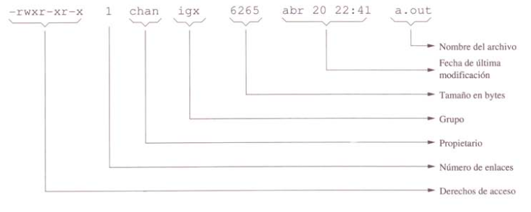

# 4.5.9.- ls

*Sintaxis:* **ls [-laAFhrtSd] [archivo(s)]**

El programa **ls** se utiliza para listar los archivos contenidos en un determinado directorio. Si no se le especifica ningún archivo ni directorio como argumento en la línea de mandatos, por defecto se visualizará el contenido del directorio de trabajo actual.

Esta orden admite opciones, algunas de las más comunes son las que se citan a continuación:

 * **-a**: no ignora las entradas que empiezan con punto (*.*).

 * **-A**: no muestra las entradas "punto" (*.*) y "punto punto" (*..*).

 * **-h**: imprime el tamaño de los archivos en un formato legible para humanos.

 * **-F**: añade un indicador a cada entrada clasificando el tipo de fichero. 

 * **-r**: invierte el orden al mostrar las entradas.

 * **-t**: ordena por fecha de modificación.

 * **-S**: ordena por tamaño de archivo.

 * **-d**: muestra las entradas de directorio en lugar de su contenido, y no elimina la referencia de los enlaces simbólicos.

 * **-l**: imprime un listado de entradas en formato largo.



Ejemplo:

```bash
# ls -l
total 20
-rwxr--r-- 1 sistemas sistemas 1452 Nov 21  2011 comprueba_disco_hijo.sh
-rwxr--r-- 1 sistemas sistemas  469 Nov 21  2011 comprueba_disco.sh
drwxrwxr-x 2 sistemas sistemas 4096 Nov 10  2015 diskio_status
-rw-rw-r-- 1 sistemas sistemas  839 May  6  2014 pruebacorreo_telnet.txt
-rwxr-xr-x 1 sistemas sistemas 2668 May 11  2015 vigilar_sobrecarga
```

La expresión *total 20* indica los bloques de disco (bloques de datos) ocupados por los archivos del directorio listado, que en este caso son 20. Los campos que aparecen por cada archivo, de izquierda a derecha, son los siguientes:

 * Modo de archivo.

 * Número de enlaces: un enlace permite que un archivo pueda aparecer en lugares diferentes en la estructura de directorio sin necesidad de tener su copia física repetida en el disco, lo que permite un mejor aprovechamiento del espacio. Para archivos normales, este número de enlaces suele ser 1. Si es mayor que 1, el número de enlaces indicará cuántas copias idénticas del archivo existen en los distintos directorios del sistema. Cuando el archivo es un directorio, *links* indica cuántos subdirectorios tiene ese directorio.

 * Propietario.

 * Grupo propietario.

 * Tamaño del archivo en bytes.

 * Fecha y hora de la última modificación.

 * Nombre del archivo.
