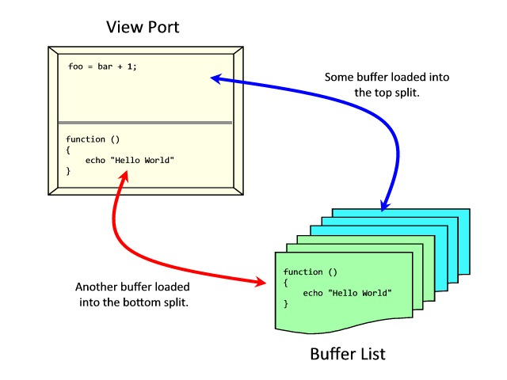

# 7.1.- MÚLTIPLES DOCUMENTOS

### 7.1.1.- BUFFERS

Un buffer es la copia de un archivo de texto que permanece en memoria para su edición. Cuando se abre un archivo, éste se carga en un buffer de memoria, y ahí es donde se aplican los cambios mientras se trabaja. Cuando se inicia un nuevo documento, el texto permanece en un buffer de memoria hasta que se decide escribir en disco.

Normalmente sólo se puede editar un único buffer a la vez, así que el buffer activo es el único que se muestra por pantalla, mientras que el resto de buffers permanecen ocultos. Cuando se abre un archivo, un nuevo buffer es creado e inmediatamente mostrado por pantalla. El buffer activo hasta ese momento, se oculta.

Un buffer puede estar en uno de los siguientes estados:

* `activo`: El buffer se muestra en un [viewport]. Si hay un archivo asociado al buffer, éste ha sido copiado dentro del buffer. El buffer ha podido ser modificado desde entonces y por lo tanto ser diferente del archivo.

* `oculto`: El buffer no se muestra en un [viewport] pero funciona como un buffer `activo`.

* `inactivo`: El buffer ni se muestra ni contiene texto.

|*Comando*|*Descripción*|
|:---|:---|
|`:buffers`|Muestra una lista de buffers|
|`:ls`|Alias al comando `:buffers`|
|`:bn`|Activa el siguiente buffer|
|`:bp`|Activa el buffer previo|
|`:b[uffer] {#}`|Activa el buffer número #|
|`:b[uffer] {str}`|Activa el buffer con {str} en el nombre|
|`:bd[elete] [{#}] [{str}]`|Elimina el buffer actual de la lista de buffers si no se indica el número # o el nombre {str}|
|`:wn`|Guarda el contenido del buffer en el archivo y activa el siguiente buffer|
|`:wp`|Guarda el contenido del buffer en el archivo y activa el buffer previo|
|`:badd {file}`|Añade el fichero a la lista de buffers|

### 7.1.2.- WINDOWS

El termino [windows] se refiere a una ventana ([viewport]) donde se muestra un buffer.

Una característica realmente útil en Vim es la habilidad de dividir el área visible entre uno o más viewports. Cada uno tiene acceso a la lista interna de buffers de Vim. De esta manera se pueden tener múltiples buffers en la pantalla al mismo tiempo o se puede cargar el mismo buffer en dos viewports y comprobar que los cambios realizados en un lado, se ven reflejados inmediatamente en el otro.

|*Comando*|*Descripción*|
|:---|:---|
|`:new [{file}]`|Divide la ventana horizontalmente con un nuevo documento. No es necesario proporcionar un nombre de fichero|
|`:sp[lit] {file}`|Divide el archivo actual (o un nombre de archivo dado) horizontalmente en dos viewports del mismo tamaño|
|`:vsp[lit] {file}`|Divide el archivo actual (o un nombre de archivo dado) verticalmente en dos viewports del mismo tamaño|
|`:{#} sp {file}`|Abre un archivo en una vista horizontal con un tamaño de # líneas|
|`:sview {file}`|Abre un archivo en una vista dividida horizontalmente para visualización (sólo lectura)|
|`:vert sview {file}`|Abre un archivo en una vista dividida verticalmente para visualización (sólo lectura)|
|`<C-w> n`|Divide la ventana horizontalmente con un nuevo documento sin nombre|
|`<C-w> s`|Abre un viewport horizontal con el mismo buffer del viewport actual|
|`<C-w> v`|Abre un viewport vertical con el mismo buffer del viewport actual|
|`<C-w> o`|Convierte el viewport actual único en la pantalla|
|`<C-w> h`|Se mueve un viewport a la izquierda|
|`<C-w> j`|Se mueve un viewport abajo|
|`<C-w> k`|Se mueve un viewport arriba|
|`<C-w> l`|Se mueve un viewport a la derecha|
|`<C-w> {#}[-+]`|Aumenta/Reduce # líneas el tamaño del viewport actual en vertical|
|`<C-w> {#}[<>]`|Aumenta/Reduce # unidades el tamaño del viewport actual en horizontal|
|`<C-w> =`|Hace que todos los viewports tengan el mismo tamaño|
|`<C-w> q`|Cierra el viewport actual. Si es el único viewport abierto, Vim preguntará si desea guardar el archivo si éste no ha sido guardado|
|`<C-w> _ `|Maximiza el viewport actual en una división horizontal|
|`<C-w> |`|Maximiza el viewport actual en una división vertical|
|`<C-w> r`|Gira una posición el viewport hacia la derecha/abajo|

### 7.1.3.- TABS

Tabs Vim son esencialmente espacios de trabajo (work-spaces), una colección de viewports.

|*Comando*|*Descripción*|
|:---|:---|
|`:tabs`|Muestra las pestañas actuales|
|`:tabnew`|Crea una nueva pestaña sin nombre|
|`:tabe[dit] {file}`|Crea una nueva pestaña con el nombre de archivo {file}|
|`[{#}]gt`|Se mueve a la siguiente pestaña o a la pestaña con número {#}|
|`:tabc[lose] [{#}]`|Cierra la pestaña actual o la pestaña con número {#}|
|`:tabo[nly]`|Cierra todas las pestañas excepto la actual|
|`:tab ball`|Pone todos los archivos abiertos en pestañas|
|`:tab help`|Pone una página de ayuda en su propia pestaña|
|`:tab split`|Copia la ventana actual a una nueva pestaña|

## Enlaces

- Sección previa: [Introducción](07.0.0.md)
- Siguiente sección: [Modos](07.2.0.md)
